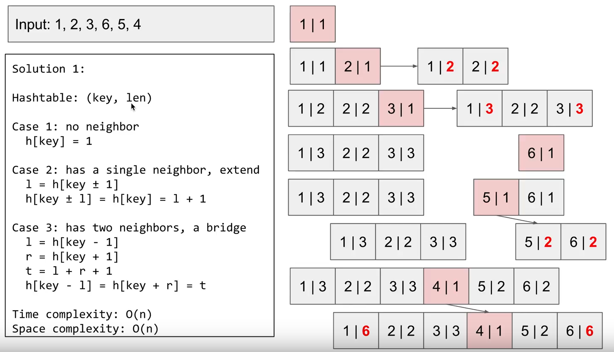

# 128. 最长连续序列

[链接](https://leetcode-cn.com/problems/longest-consecutive-sequence/description/)

给定一个未排序的整数数组，找出最长连续序列的长度。

要求算法的时间复杂度为 *O(n)*。

**示例:**

```
输入: [100, 4, 200, 1, 3, 2]
输出: 4
解释: 最长连续序列是 [1, 2, 3, 4]。它的长度为 4。
```

**思路分析**

- 排序
- 哈希表

**我的实现：排序**

```c++
class Solution {
public:
    int longestConsecutive(vector<int>& nums) {
        if(nums.empty()) return 0;
        sort(nums.begin(), nums.end(), [](int a, int b){return a<b;});
        int res = 1;
        int count = 1;
        for(int i=0; i<nums.size(); ++i)
        {
            if(i+1 < nums.size() && nums[i] == nums[i+1])
                continue;
            else if(i+1 < nums.size() && nums[i+1] == nums[i] + 1)
                ++count;
            else
            {
                res = max(res,count);
                count = 1;
            }
        }
        return res;
    }
};
```

时间复杂度：O(nlogn)

空间复杂度：O(1)

**我的实现：哈希表**

[参考链接](https://www.youtube.com/watch?v=rc2QdQ7U78I)



```c++
class Solution {
public:
    int longestConsecutive(vector<int>& nums) {
        if(nums.empty()) return 0;
        unordered_map<int,int> m;
        int res = 0;
        for(int num : nums)
        {
            //重复的话就忽略
            if(m.find(num) != m.end()) continue;
            int left = m.find(num-1)==m.end() ? 0 : m[num-1];
            int right = m.find(num+1)==m.end() ? 0: m[num+1];
            
            m[num] = m[num-left] = m[num+right] = 1 + left + right; 
            
            res = max(res, m[num]);
        }
        return res;
    }
};
```

时间复杂度：O(n)

空间复杂度：O(n)