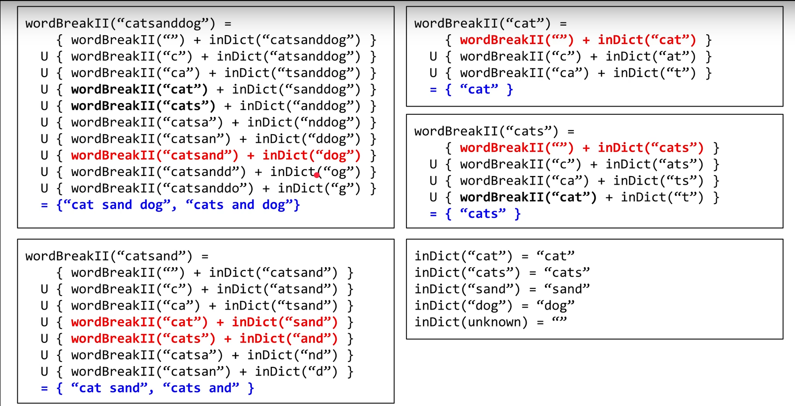

# 140. 单词拆分 II

[链接](https://leetcode-cn.com/problems/word-break-ii/description/)

给定一个**非空**字符串 *s* 和一个包含**非空**单词列表的字典 *wordDict*，在字符串中增加空格来构建一个句子，使得句子中所有的单词都在词典中。返回所有这些可能的句子。

**说明：**

- 分隔时可以重复使用字典中的单词。
- 你可以假设字典中没有重复的单词。

**示例 1：**

```
输入:
s = "catsanddog"
wordDict = ["cat", "cats", "and", "sand", "dog"]
输出:
[
  "cats and dog",
  "cat sand dog"
]
```

**示例 2：**

```
输入:
s = "pineapplepenapple"
wordDict = ["apple", "pen", "applepen", "pine", "pineapple"]
输出:
[
  "pine apple pen apple",
  "pineapple pen apple",
  "pine applepen apple"
]
解释: 注意你可以重复使用字典中的单词。
```

**示例 3：**

```
输入:
s = "catsandog"
wordDict = ["cats", "dog", "sand", "and", "cat"]
输出:
[]
```

**思路分析**

[参考链接](https://www.youtube.com/watch?v=JqOIRBC0_9c)



**我的实现**

```c++
class Solution {
public:
    vector<string> wordBreak(string s, vector<string>& wordDict) {
        if(s.empty() || wordDict.empty()) return {};
        unordered_set<string> dict(wordDict.begin(),wordDict.end());
        return helper(s,dict);
    }
private:
    vector<string> append(const vector<string>& left, string right)
    {
        vector<string> res;
        for(string str : left)
            res.push_back(str+" "+right);
        return res;
    }
    vector<string> helper(string s, unordered_set<string> dict)
    {
        if(mem.find(s)!=mem.end()) return mem[s];
        
        //s能拆分成的字符串集
        vector<string> res;
        
        //s本身就在字典内
        if(dict.find(s)!=dict.end())
            res.push_back(s);
        
        //对s进行拆分
        for(int i=1; i<s.size(); ++i)
        {
            //s[i,s.size()-1]
            string right = s.substr(i);
            //如果右半部分不在字典中，则该情况下无法构成正确的拆分，直接跳过
            if(dict.find(right)==dict.end()) continue;
            
            string left = s.substr(0,i);
            vector<string> temp = append(helper(left,dict),right);
            
            res.insert(res.end(),temp.begin(),temp.end());
        }
        
        //如果s无法拆分，也会将其记录在mem中，记录的second为空vector<string>
        return mem[s] = res;
    }
private:
    unordered_map<string,vector<string>> mem;
};
```

