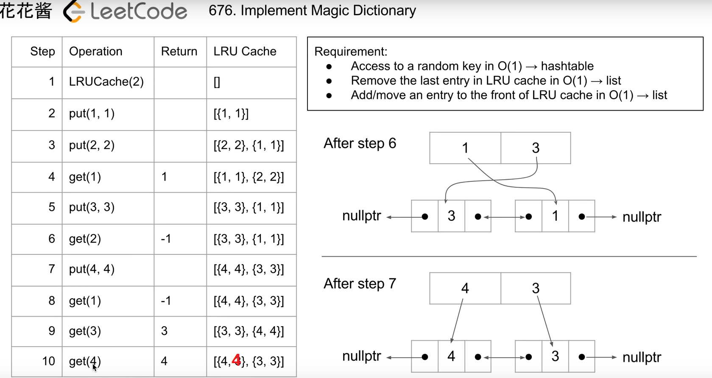

# 146. LRU缓存机制

[链接](https://leetcode-cn.com/problems/lru-cache/description/)

运用你所掌握的数据结构，设计和实现一个  [LRU (最近最久未使用) 缓存机制](https://baike.baidu.com/item/LRU)。它应该支持以下操作： 获取数据 `get` 和 写入数据 `put` 。

获取数据 `get(key)` - 如果密钥 (key) 存在于缓存中，则获取密钥的值（总是正数），否则返回 -1。
 写入数据 `put(key, value)` - 如果密钥不存在，则写入其数据值。当缓存容量达到上限时，它应该在写入新数据之前删除最近最少使用的数据值，从而为新的数据值留出空间。

**进阶:**

你是否可以在 **O(1)** 时间复杂度内完成这两种操作？

**示例:**

```
LRUCache cache = new LRUCache( 2 /* 缓存容量 */ );

cache.put(1, 1);
cache.put(2, 2);
cache.get(1);       // 返回  1
cache.put(3, 3);    // 该操作会使得密钥 2 作废
cache.get(2);       // 返回 -1 (未找到)
cache.put(4, 4);    // 该操作会使得密钥 1 作废
cache.get(1);       // 返回 -1 (未找到)
cache.get(3);       // 返回  3
cache.get(4);       // 返回  4
```

**思路分析**

[参考链接](https://www.youtube.com/watch?v=q1Njd3NWvlY)



使用list和unordered_map实现

**我的实现**

```c++
class LRUCache {
public:
    LRUCache(int capacity):capacity_(capacity) {
        
    }
    
    int get(int key) {
        auto iter = m_.find(key);
        if(iter==m_.end()) return -1;
        
        //将list node放到最前面
        cache_.splice(cache_.begin(),cache_,iter->second);
        return iter->second->second;
    }
    
    void put(int key, int value) {
        auto iter = m_.find(key);
        //如果节点已经存在，则只需要更新其value，并把list node放到最前面
        if(iter!=m_.end())
        {
            iter->second->second = value;
            cache_.splice(cache_.begin(),cache_,iter->second);
            return;
        }
        
        //如果达到最大容量，将最后的list node删掉
        if(cache_.size()==capacity_)
        {
            auto delPair = cache_.back();
            m_.erase(delPair.first);
            cache_.pop_back();
        }
        
        //使用emplace直接构造
        cache_.emplace_front(key,value);
        auto front = cache_.begin();
        m_[key] = front;
    }
private:
    int capacity_;
    //<key,value>
    list<pair<int,int>> cache_;
    unordered_map<int,list<pair<int,int>>::iterator> m_;
};

/**
 * Your LRUCache object will be instantiated and called as such:
 * LRUCache obj = new LRUCache(capacity);
 * int param_1 = obj.get(key);
 * obj.put(key,value);
 */
```

**二刷**

```c++
class LRUCache {
public:
    LRUCache(int capacity):cap(capacity) {
        
    }
    
    int get(int key) {
        auto iter = m.find(key);
        if(iter==m.end()) return -1;
        
        int res = iter->second->second;
        l.push_front(*(iter->second));
        l.erase(iter->second);
        m[key] = l.begin();
        return res;
    }
    
    void put(int key, int value) {
        auto iter = m.find(key);
        
        if(iter!=m.end())
        {
            iter->second->second = value;
            l.push_front(*(iter->second));
            l.erase(iter->second);
            m[key] = l.begin();
            return;
        }
        
        l.emplace_front(key,value);
        m[key] = l.begin();
        
        if(l.size()>cap)
        {
            int dkey = l.back().first;
            m.erase(dkey);
            l.pop_back();
        }
    }
private:
    int cap;
    list<pair<int,int>> l;
    unordered_map<int,list<pair<int,int>>::iterator> m;
};

/**
 * Your LRUCache object will be instantiated and called as such:
 * LRUCache obj = new LRUCache(capacity);
 * int param_1 = obj.get(key);
 * obj.put(key,value);
 */
```

