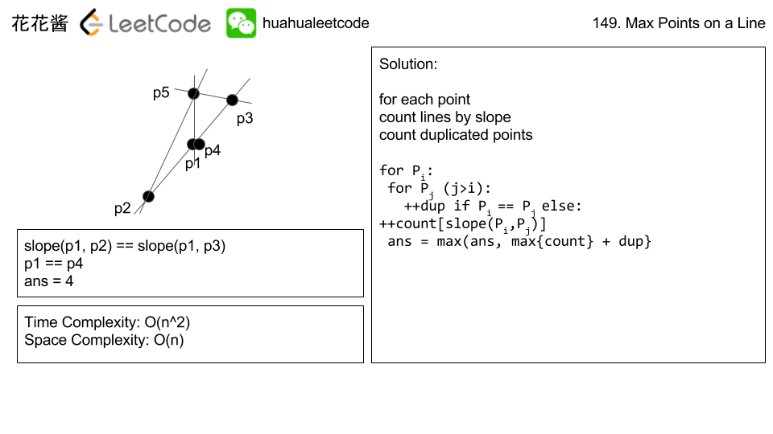

# 149. 直线上最多的点数

[链接](https://leetcode-cn.com/problems/max-points-on-a-line/description/)

给定一个二维平面，平面上有 *n* 个点，求最多有多少个点在同一条直线上。

**示例 1:**

```
输入: [[1,1],[2,2],[3,3]]
输出: 3
解释:
^
|
|        o
|     o
|  o  
+------------->
0  1  2  3  4
```

**示例 2:**

```
输入: [[1,1],[3,2],[5,3],[4,1],[2,3],[1,4]]
输出: 4
解释:
^
|
|  o
|     o        o
|        o
|  o        o
+------------------->
0  1  2  3  4  5  6
```

**思路分析**

[参考链接](http://zxi.mytechroad.com/blog/geometry/leetcode-149-max-points-on-a-line/)



基本思路：对数组中每个点i与i+1到n（n表示最后一个点）的斜率（斜率用分数表示，更精确），统计对于点i，斜率相同的最大值，判断其是否为所有点中的最大值

其中涉及欧几里得算法（根据该算法求最大公约数）：两个整数的最大公约数等于其中较小的那个数和两数相除余数的最大公约数。 

**我的实现**

```c++
/**
 * Definition for a point.
 * struct Point {
 *     int x;
 *     int y;
 *     Point() : x(0), y(0) {}
 *     Point(int a, int b) : x(a), y(b) {}
 * };
 */
class Solution {
public:
    int maxPoints(vector<Point>& points) {
        int n = points.size();
        int res = 0;
        for(int i=0; i<n; ++i)
        {
            //key为斜率，value为计数
            //为了简便，这里使用map
            //如果使用hashmap，需要定义hash函数
            map<pair<int,int>,int> count;
            const Point& p1 = points[i];
            int maxCount = 0;
            //记录相同点数
            int samePoint = 1;
            for(int j=i+1; j<n; ++j)
            {
                const Point& p2 = points[j];
                //如果是相同的点
                if(p1.x==p2.x && p1.y==p2.y)
                {
                    ++samePoint;
                }else
                {
                    maxCount = max(maxCount, ++count[getSlope(p1,p2)]);
                }
            }
            res = max(res, samePoint+maxCount);
        }
        return res;
    }
    
private:
    int gcd(int m, int n)
    {
        return n==0 ? m : gcd(n, m%n);
    }
    pair<int,int> getSlope(const Point& p1, const Point& p2)
    {
        int diffX = p1.x - p2.x;
        int diffY = p1.y - p2.y;
        //垂直线，使用一种特殊的记法
        if(diffX==0) return pair<int,int>(p1.x, 0);
        //水平线，使用一种特殊的记法
        if(diffY==0) return pair<int,int>(0, p1.y);
        
        int d = gcd(diffX,diffY);
        return pair<int,int>(diffY/d, diffX/d);
    }
};
```

