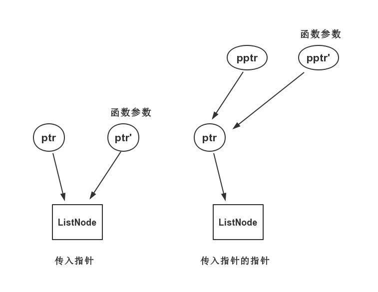

# 2.两数相加

[链接](https://leetcode-cn.com/problems/add-two-numbers/description/)

给定两个**非空**链表来表示两个非负整数。位数按照**逆序**方式存储，它们的每个节点只存储单个数字。将两数相加返回一个新的链表。

你可以假设除了数字 0 之外，这两个数字都不会以零开头。

**示例：**

```
输入：(2 -> 4 -> 3) + (5 -> 6 -> 4)
输出：7 -> 0 -> 8
原因：342 + 465 = 807
```

**思路分析**


**我的实现**

```c++
/**
 * Definition for singly-linked list.
 * struct ListNode {
 *     int val;
 *     ListNode *next;
 *     ListNode(int x) : val(x), next(NULL) {}
 * };
 */
class Solution {
public:
    //注意这里：指针的指针
	void addTwoNumbersCore(int val1, int val2, int &carry, ListNode** pTemp, ListNode** pResult)
	{
		int sum = val1 + val2 + carry;
		if (sum >= 10)
		{
			sum -= 10;
			carry = 1;
		}
		else
			carry = 0;

		ListNode *nNode = new ListNode(sum);
		if ( *pResult == nullptr)
		{
			*pTemp = nNode;
			*pResult = nNode;
		}
		else
		{
			(*pTemp)->next = nNode;
			(*pTemp) = nNode;
		}
	}
    
    ListNode* addTwoNumbers(ListNode* l1, ListNode* l2) {
        ListNode* result = nullptr;
        ListNode* temp = nullptr;
        int carry = 0;
        while( l1 != nullptr && l2 != nullptr )
        {
            addTwoNumbersCore(l1->val,l2->val,carry,&temp,&result);
            l1 = l1->next;
            l2 = l2->next;
        }
        
        while( l1 != nullptr )
        {
            addTwoNumbersCore(l1->val,0,carry,&temp,&result);
            l1 = l1->next;
        }
        
        while( l2 != nullptr )
        {
            addTwoNumbersCore(0,l2->val,carry,&temp,&result);
            l2 = l2->next;
        }
        
        if( carry == 1 )
        	 addTwoNumbersCore(0,0,carry,&temp,&result);
        
        return result;
    }
};
```

**反思**

注意在函数中修改指针的指向时，应该使用指针的指针



如图，本题中addTwoNumbersCore函数要修改的就是ptr的指向，因此应该传入ptr的指针