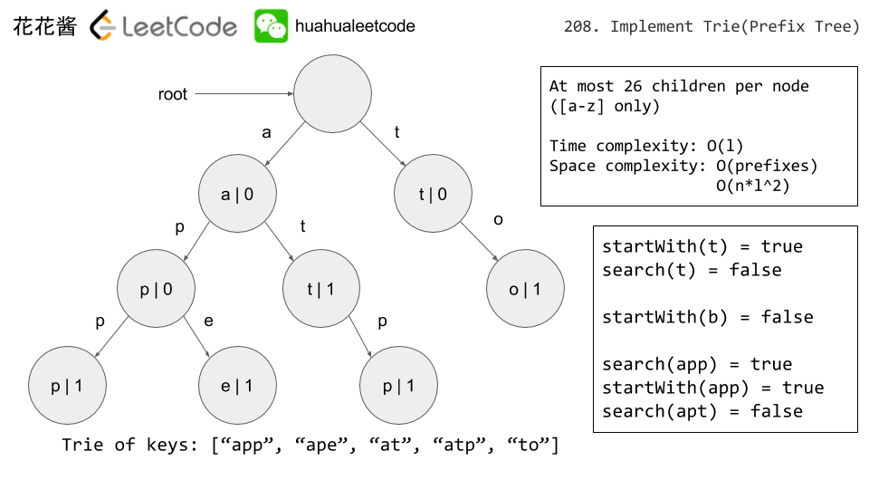

# 208. 实现前缀树

[链接](https://leetcode-cn.com/problems/implement-trie-prefix-tree/description/)

实现一个 Trie (前缀树)，包含 `insert`, `search`, 和 `startsWith` 这三个操作。

**示例:**

```
Trie trie = new Trie();

trie.insert("apple");
trie.search("apple");   // 返回 true
trie.search("app");     // 返回 false
trie.startsWith("app"); // 返回 true
trie.insert("app");   
trie.search("app");     // 返回 true
```

**说明:**

- 你可以假设所有的输入都是由小写字母 `a-z` 构成的。
- 保证所有输入均为非空字符串。

**思路分析**

[参考链接](https://www.youtube.com/watch?v=f48wGD-MuQw)



**我的实现**

```c++
class Trie {
public:
	/** Initialize your data structure here. */
	Trie() : root(new TreeNode()) {
		
	}

	/** Inserts a word into the trie. */
	void insert(string word) {
		TreeNode* p = root.get();
		for (char c : word)
		{
			if (p->child.find(c) == p->child.end())
				(p->child)[c] = new TreeNode();
			p = (p->child)[c];
		}
		p->isWord = true;
	}

	/** Returns if the word is in the trie. */
	bool search(string word) {
		TreeNode* p = find(word);
		return p && p->isWord;
	}

	/** Returns if there is any word in the trie that starts with the given prefix. */
	bool startsWith(string prefix) {
		TreeNode* p = find(prefix);
		return p != nullptr;
	}

private:
	struct TreeNode
	{

		TreeNode() :isWord(false) {}
		~TreeNode()
		{
			for (auto& kv : child)
			{
				if (kv.second) delete kv.second;
			}
		}
		bool isWord;
		unordered_map<char, TreeNode*> child;
	};

private:
	TreeNode* find(string word)
	{
		TreeNode* p = root.get();
		for (char c : word)
		{
			if (p->child.find(c) == p->child.end())
			{
				p = nullptr;
				break;
			}
			p = (p->child)[c];
		}
		return p;
	}


private:
	shared_ptr<TreeNode> root;
};

/**
* Your Trie object will be instantiated and called as such:
* Trie obj = new Trie();
* obj.insert(word);
* bool param_2 = obj.search(word);
* bool param_3 = obj.startsWith(prefix);
*/
```

