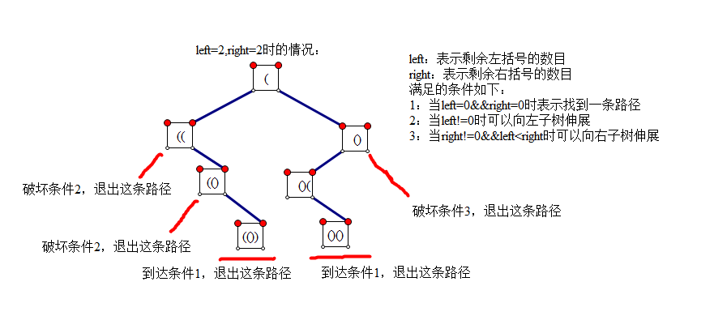

# 22. 括号生成

[链接](https://leetcode-cn.com/problems/generate-parentheses/description/)

给出 *n* 代表生成括号的对数，请你写出一个函数，使其能够生成所有可能的并且**有效的**括号组合。

例如，给出 *n* = 3，生成结果为：

```
[
  "((()))",
  "(()())",
  "(())()",
  "()(())",
  "()()()"
]
```

**思路分析**

[参考链接](https://blog.csdn.net/u012501459/article/details/46787097)



**我的实现**

```c++
class Solution {
public:
    void generateCore(int left, int right, string path, vector<string>& result)
    {
        if( left == 0 && right == 0 )
            result.push_back(path);
        if( left != 0 )
            generateCore( left-1, right, path+"(", result );
        if( right != 0 && left < right )
            generateCore( left, right-1, path+")", result );
    }
    vector<string> generateParenthesis(int n) {
        vector<string> result;
        string s("");
        generateCore(n,n,s,result);
        return result;
    }
};
```

