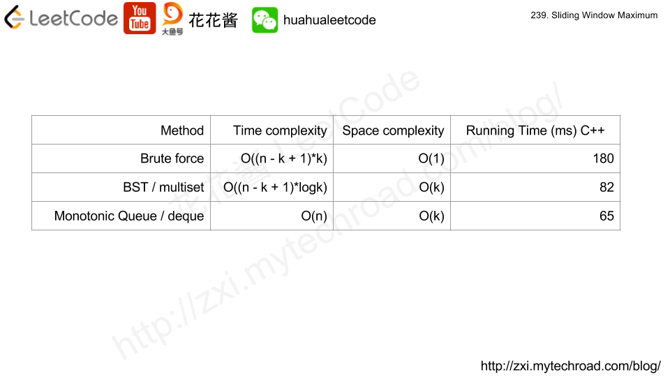

# 239.滑动窗口最大值

[链接](https://leetcode-cn.com/problems/sliding-window-maximum/description/)

给定一个数组 *nums*，有一个大小为 *k* 的滑动窗口从数组的最左侧移动到数组的最右侧。你只可以看到在滑动窗口 *k* 内的数字。滑动窗口每次只向右移动一位。

返回滑动窗口最大值。

**示例:**

```
输入: nums = [1,3,-1,-3,5,3,6,7], 和 k = 3
输出: [3,3,5,5,6,7] 
解释: 

  滑动窗口的位置                最大值
---------------               -----
[1  3  -1] -3  5  3  6  7       3
 1 [3  -1  -3] 5  3  6  7       3
 1  3 [-1  -3  5] 3  6  7       5
 1  3  -1 [-3  5  3] 6  7       5
 1  3  -1  -3 [5  3  6] 7       6
 1  3  -1  -3  5 [3  6  7]      7
```

**注意：**

你可以假设 *k* 总是有效的，1 ≤ k ≤ 输入数组的大小，且输入数组不为空。

**进阶：**

你能在线性时间复杂度内解决此题吗？

**思路分析**

[参考链接](http://zxi.mytechroad.com/blog/heap/leetcode-239-sliding-window-maximum/)

有三种解决方案：



其中单调队列(MonotonicQueue)是最佳方案

单调队列中存储的是可能成为最大值的元素，它的基本思想是：

- 使用deque作为底层容器
- push一个元素时，从队尾push，并且移除队列中所有小于它的元素（因为小于的元素将来也不可能再成为最大值）
- 最大元素位于队首

**我的实现**

```c++
class MonotonicQueue {
public:
	void push(int e)
	{
		//当deque非空，且队尾元素小于e时，将队尾元素弹出
		while (!data.empty() && data.back()<e) data.pop_back();
		data.push_back(e);
	}
	void pop()
	{
		data.pop_front();
	}
	int max()
	{
		return data.front();
	}
private:
	deque<int> data;
};
class Solution {
public:
	vector<int> maxSlidingWindow(vector<int>& nums, int k) {
		if (nums.empty() || k <= 0) return {};
		MonotonicQueue mq;
		//将前k个元素压入
		for (int i = 0; i<k; ++i)
			mq.push(nums[i]);

		vector<int> res;
		//把前k个元素中的最大值先存入res
		res.push_back(mq.max());
		for (int i = k; i<nums.size(); ++i)
		{
			mq.push(nums[i]);
			//如果mq中队首元素（最大值）滑出了窗口，则把队首元素弹出（队首一定是最早入队的那个）
			if (nums[i-k] == mq.max()) mq.pop();
			res.push_back(mq.max());
		}
		return res;
	}
};
```

