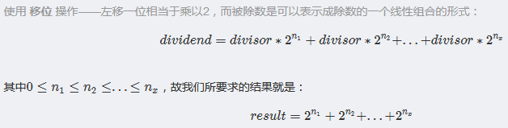

# 29. 两数相除

[链接](https://leetcode-cn.com/problems/divide-two-integers/description/)

给定两个整数，被除数 `dividend` 和除数 `divisor`。将两数相除，要求不使用乘法、除法和 mod 运算符。

返回被除数 `dividend` 除以除数 `divisor` 得到的商。

**示例 1:**

```
输入: dividend = 10, divisor = 3
输出: 3
```

**示例 2:**

```
输入: dividend = 7, divisor = -3
输出: -2
```

**说明:**

- 被除数和除数均为 32 位有符号整数。
- 除数不为 0。
- 假设我们的环境只能存储 32 位有符号整数，其数值范围是 [−2^31,  2^31 − 1]。本题中，如果除法结果溢出，则返回 2^31 − 1。

**思路分析**

[参考链接](https://blog.csdn.net/lisonglisonglisong/article/details/45959879)



int的范围是 [-2147483648，2147483647]，所以存在的溢出情况是：-2147483648除以-1，此时应该输出`INT_MAX` 

**我的实现**

```c++
class Solution {
public:
    int divide(int dividend, int divisor) {
        bool positive = true;
        if( (dividend<0 && divisor>0) || (dividend>0 && divisor<0) )
            positive = false;
        long long dividendll = abs((long long)dividend);
        long long divisorll = abs((long long)divisor);
        long long result = 0;
        
        while( dividendll >= divisorll )
        {
            long long temp = divisorll;
            long long count = 1;
            while( (temp<<1) <= dividendll )
            {
                temp = temp << 1;
                count = count << 1;
            }
            dividendll -= temp;
            result += count;
        }
        // INT_MAX / -1 时溢出
        if( positive && result >= INT_MAX )
            return INT_MAX;
        return positive ? result : -result;
    }
};
```

