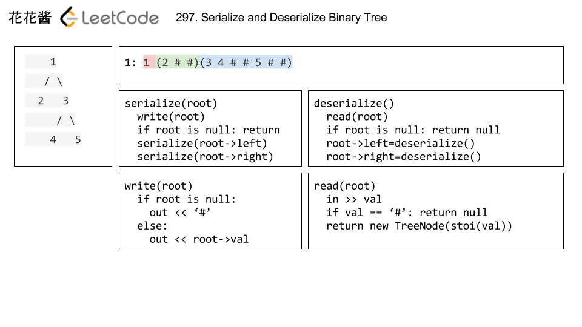
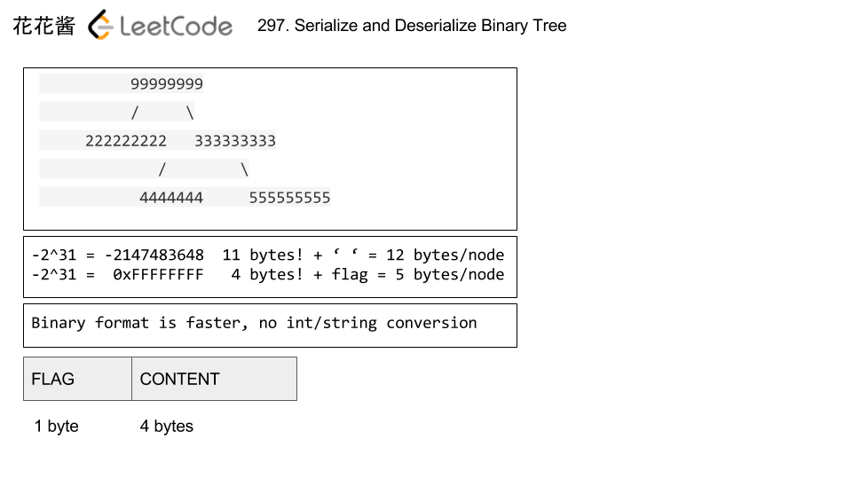

# 297. 二叉树的序列化与反序列化

[链接](https://leetcode-cn.com/problems/serialize-and-deserialize-binary-tree/description/)

序列化是将一个数据结构或者对象转换为连续的比特位的操作，进而可以将转换后的数据存储在一个文件或者内存中，同时也可以通过网络传输到另一个计算机环境，采取相反方式重构得到原数据。

请设计一个算法来实现二叉树的序列化与反序列化。这里不限定你的序列 / 反序列化算法执行逻辑，你只需要保证一个二叉树可以被序列化为一个字符串并且将这个字符串反序列化为原始的树结构。

**示例:** 

```
你可以将以下二叉树：

    1
   / \
  2   3
     / \
    4   5

序列化为 "[1,2,3,null,null,4,5]"
```

**提示:** 这与 LeetCode 目前使用的方式一致，详情请参阅 [LeetCode 序列化二叉树的格式](https://leetcode-cn.com/faq/#binary-tree)。你并非必须采取这种方式，你也可以采用其他的方法解决这个问题。

**说明:** 不要使用类的成员 / 全局 / 静态变量来存储状态，你的序列化和反序列化算法应该是无状态的。

**思路分析**

[参考链接](http://zxi.mytechroad.com/blog/tree/leetcode-297-serialize-and-deserialize-binary-tree/)

有两个方法：

- 直接使用字符串传递
- 转为二进制再转为字符串传递
  - 优势：
    - 当节点值都非常大时，可以更节省空间
    - 不需要字符串到整型的转换
  - 缺点：
    - 不同系统（32位或64位）的整型的大小不一致

**我的实现：字符串**



需要使用到ostringstream和istringstream

```c++
/**
 * Definition for a binary tree node.
 * struct TreeNode {
 *     int val;
 *     TreeNode *left;
 *     TreeNode *right;
 *     TreeNode(int x) : val(x), left(NULL), right(NULL) {}
 * };
 */
class Codec {
public:

    // Encodes a tree to a single string.
    string serialize(TreeNode* root) {
        ostringstream out;
        serialize(root,out);
        return out.str();
    }

    // Decodes your encoded data to tree.
    TreeNode* deserialize(string data) {
        istringstream in(data);
        return deserialize(in);
    }
private:
    void serialize(TreeNode* root, ostringstream& out)
    {
        if(!root)
        {
            out << "# ";
            return;
        }
        out << root->val << " ";
        serialize(root->left, out);
        serialize(root->right, out);
    }
    TreeNode* deserialize(istringstream& in)
    {
        string val;
        in >> val;
        if(val=="#") return nullptr;
        TreeNode* root = new TreeNode(stoi(val));
        root->left = deserialize(in);
        root->right = deserialize(in);
        return root;
    }
};

// Your Codec object will be instantiated and called as such:
// Codec codec;
// codec.deserialize(codec.serialize(root));
```

**我的实现：二进制**



```c++
/**
 * Definition for a binary tree node.
 * struct TreeNode {
 *     int val;
 *     TreeNode *left;
 *     TreeNode *right;
 *     TreeNode(int x) : val(x), left(NULL), right(NULL) {}
 * };
 */
class Codec {
public:

    // Encodes a tree to a single string.
    string serialize(TreeNode* root) {
        ostringstream out;
        serialize(root,out);
        return out.str();
    }

    // Decodes your encoded data to tree.
    TreeNode* deserialize(string data) {
        istringstream in(data);
        return deserialize(in);
    }
private:
    enum STATUS{
        NONE = 0x00, //空节点
        ROOT = 0x01, //非空节点
        LEFT = 0x02, //有左子树
        RIGHT = 0x04 //有右子树
    };
private:
    void serialize(TreeNode* root, ostringstream& out) {
        char status = 0;
        if(root) status |= ROOT;
        if(root && root->left) status |= LEFT;
        if(root && root->right) status |= RIGHT;
        out.write(&status,sizeof(char));
        if(!root) return;
        
        out.write((char*)(&(root->val)), sizeof(root->val));
        if(root->left) serialize(root->left,out);
        if(root->right) serialize(root->right,out);
    }
    TreeNode* deserialize(istringstream& in) {
        char status;
        in.read(&status,sizeof(char));
        if(!(status&ROOT)) return nullptr;
        TreeNode* root = new TreeNode(0);
        in.read((char*)(&(root->val)),sizeof(root->val));
        root->left = (status&LEFT) ? deserialize(in) : nullptr;
        root->right = (status&RIGHT) ? deserialize(in) : nullptr;
        return root;
    }
};

// Your Codec object will be instantiated and called as such:
// Codec codec;
// codec.deserialize(codec.serialize(root));
```

