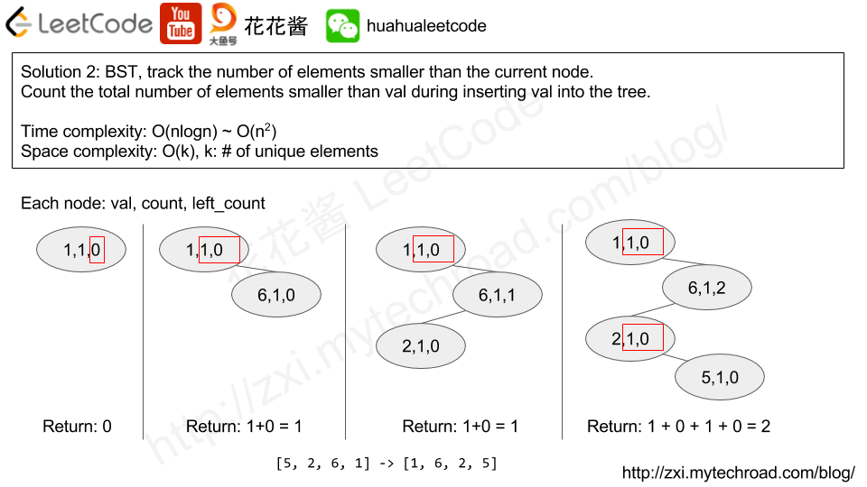

# 315. 计算右侧小于当前元素的个数

[链接](https://leetcode-cn.com/problems/count-of-smaller-numbers-after-self/description/)

给定一个整数数组 *nums*，按要求返回一个新数组 *counts*。数组 *counts* 有该性质： `counts[i]` 的值是  `nums[i]` 右侧小于 `nums[i]` 的元素的数量。

**示例:**

```
输入: [5,2,6,1]
输出: [2,1,1,0] 
解释:
5 的右侧有 2 个更小的元素 (2 和 1).
2 的右侧仅有 1 个更小的元素 (1).
6 的右侧有 1 个更小的元素 (1).
1 的右侧有 0 个更小的元素.
```

**思路分析**

[参考链接](http://zxi.mytechroad.com/blog/algorithms/array/leetcode-315-count-of-smaller-numbers-after-self/)



使用二叉搜索树BST解决

插入节点时，逆序插入

每棵树的节点维护三个值：节点值、相同值数，左子树节点数

每个新值从根节点开始插入

- 如果新值与根节点相同，则将根节点的相同值数递增1，返回左子树节点数，作为所求值
- 如果新值比根节点小，则将根节点的左子节点数递增1，并向其左子树添加新值
  - 如果根节点的左子树为空，则新值成为根的左子树的新节点，并将新节点的左子树数设为1，相同值数设为1，返回0作为所求（因为是最左子节点，因此没有比它更小的数了）
  - 如果根节点的左子树不为空，则递归调用插入函数，将递归调用的值返回（往左走不需要计算其根节点的相关信息）
- 如果新值比根节点大
  - 如果根节点的右孩子为空，则将新值作为其右孩子，并将根的（相同值数+左子树节点数）返回
  - 如果跟节点的右孩子非空，则将根的（相同值数+左子树节点数）+递归向根的右孩子添加新值的返回值，返回

**我的实现**

```c++
struct BSTNode{
    BSTNode(int v):val(v),count(1),left_count(0),left(nullptr),right(nullptr){}
    ~BSTNode(){
        if(left) delete left;
        if(right) delete right;
    }
    //返回小于等于该节点的值
    int less_or_equal()
    {
        return count+left_count;
    }
    int val;
    int count;
    int left_count;
    BSTNode* left;
    BSTNode* right;
};
class Solution {
public:
    vector<int> countSmaller(vector<int>& nums) {
        if(nums.empty()) return {};
        vector<int> res;
        //初始化nums最右数的值
        res.push_back(0);
        BSTNode* root = new BSTNode(nums[nums.size()-1]);
        for(int i=nums.size()-2; i>=0; --i)
            res.push_back(insert(root,nums[i]));
        reverse(res.begin(),res.end());
        return res;
    }
    int insert(BSTNode* root, int num)
    {
        if(num == root->val)
        {
            root->count++;
            return root->left_count;
        }
        else if(num < root->val)
        {
            ++(root->left_count);
            if(root->left==nullptr)
            {
                root->left = new BSTNode(num);   
                return 0;
            }
            return insert(root->left,num);
        }
        else
        {
            if(root->right==nullptr)
            {
                root->right = new BSTNode(num);
                return root->less_or_equal();
            }
            return root->less_or_equal() + insert(root->right,num);
        }
    }
};
```

平均时间复杂度O(nlogn)

最差时间复杂度O(n^2)