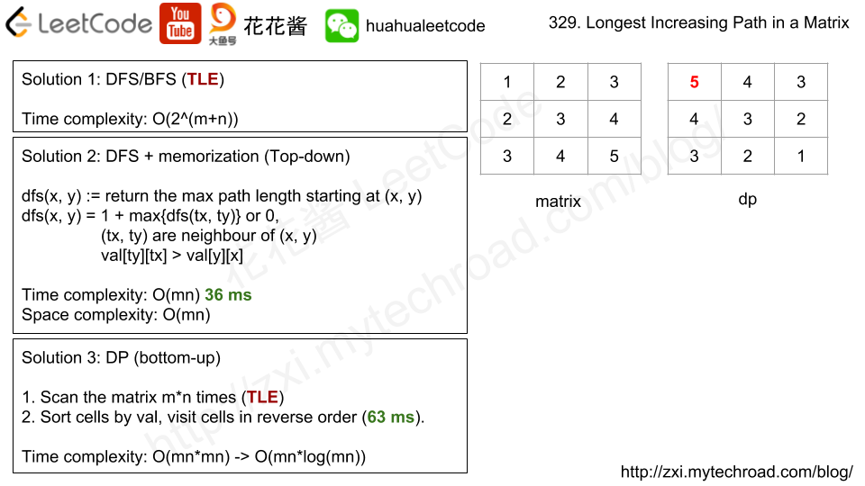

# 329. 矩阵中的最长递增路径

[链接](https://leetcode-cn.com/problems/longest-increasing-path-in-a-matrix/description/)

给定一个整数矩阵，找出最长递增路径的长度。

对于每个单元格，你可以往上，下，左，右四个方向移动。 你不能在对角线方向上移动或移动到边界外（即不允许环绕）。

**示例 1:**

```
输入: nums = 
[
  [9,9,4],
  [6,6,8],
  [2,1,1]
] 
输出: 4 
解释: 最长递增路径为 [1, 2, 6, 9]。
```

**示例 2:**

```
输入: nums = 
[
  [3,4,5],
  [3,2,6],
  [2,2,1]
] 
输出: 4 
解释: 最长递增路径是 [3, 4, 5, 6]。注意不允许在对角线方向上移动。
```

**思路分析**

[参考链接](http://zxi.mytechroad.com/blog/dynamic-programming/leetcode-329-longest-increasing-path-in-a-matrix/)



DFS+记忆体

**我的实现**

```c++
class Solution {
public:
    int longestIncreasingPath(vector<vector<int>>& matrix) {
        if(matrix.empty() || matrix[0].empty()) return 0;
        rows = matrix.size();
        cols = matrix[0].size();
        pathLen = vector<vector<int>>(rows,vector<int>(cols,-1));
        int maxLen = 0;
        for(int i=0; i<rows; ++i)
            for(int j=0; j<cols; ++j)
                maxLen = max(maxLen, dfs(matrix,i,j));
        return maxLen;
    }
    int dfs(vector<vector<int>>& matrix, int x, int y)
    {
        //表示访问过了，直接放回它的值
        if(pathLen[x][y] != -1) return pathLen[x][y];
        pathLen[x][y] = 1;
        int offsetX[] = {-1,1,0,0};
        int offsetY[] = {0,0,-1,1};
        for(int i=0; i<4; ++i)
        {
            int nX = x + offsetX[i];
            int nY = y + offsetY[i];
            if(nX<0 || rows<=nX || nY<0 || cols<=nY || matrix[nX][nY]<=matrix[x][y])
                continue;
            pathLen[x][y] = max(pathLen[x][y], 1+dfs(matrix,nX,nY));
        }
        return pathLen[x][y];
    }
private:
    int rows;
    int cols;
    vector<vector<int>> pathLen;
};
```

