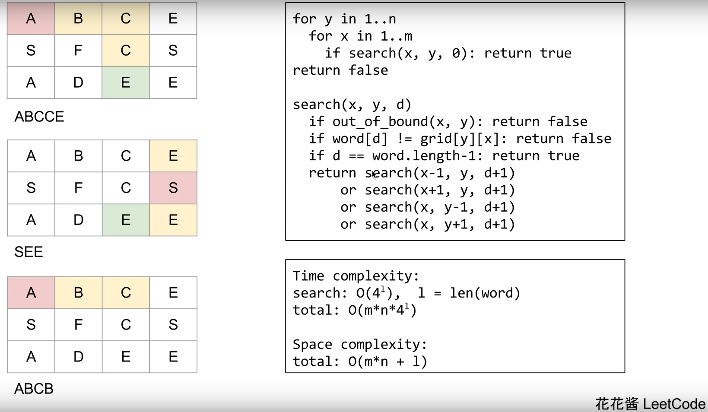

# 79. 单词搜索

[链接](https://leetcode-cn.com/problems/word-search/description/)

给定一个二维网格和一个单词，找出该单词是否存在于网格中。

单词必须按照字母顺序，通过相邻的单元格内的字母构成，其中“相邻”单元格是那些水平相邻或垂直相邻的单元格。同一个单元格内的字母不允许被重复使用。

**示例:**

```
board =
[
  ['A','B','C','E'],
  ['S','F','C','S'],
  ['A','D','E','E']
]

给定 word = "ABCCED", 返回 true.
给定 word = "SEE", 返回 true.
给定 word = "ABCB", 返回 false.
```

**思路分析**

[参考链接](https://www.youtube.com/watch?v=oUeGFKZvoo4)

深度优先遍历



**我的实现**

```c++
class Solution {
public:
    bool exist(vector<vector<char>>& board, string word) {
        if(board.empty() || board[0].empty()) return false;
        if(word=="" || word.empty()) return true;
        rows = board.size();
        cols = board[0].size();
        for(int i=0; i<rows; ++i)
        {
            for(int j=0; j<cols; ++j)
            {
                if(search(board,word,0,i,j)) return true;
            }
        }
        return false;
    }
private:
    //d表示搜索到的第几个字符
    bool search(vector<vector<char>>& board, string word, int d, int x, int y)
    {
        //超出边界、当前地图上的字符与所求字符不匹配，返回false
        if(x<0 || rows<=x || y<0 || cols<=y || word[d] != board[x][y])
            return false;
        //如果d等于word.size()-1，且word[d]等于board[x][y]
        //说明完全匹配，返回true
        if(d==word.size()-1) return true;
        
        //下面进行深度优先遍历
        
        //将当前位置设为null,表示不可访问，可以节省visited[rows][cols]空间
        char cur = board[x][y];
        board[x][y] = 0;
        bool found = search(board,word,d+1,x+1,y)
            || search(board,word,d+1,x-1,y)
            || search(board,word,d+1,x,y+1)
            || search(board,word,d+1,x,y-1);
        //重新将当前位置设为可用
        board[x][y] = cur;
        return found;
    }
private:
    int rows;
    int cols;
};
```

