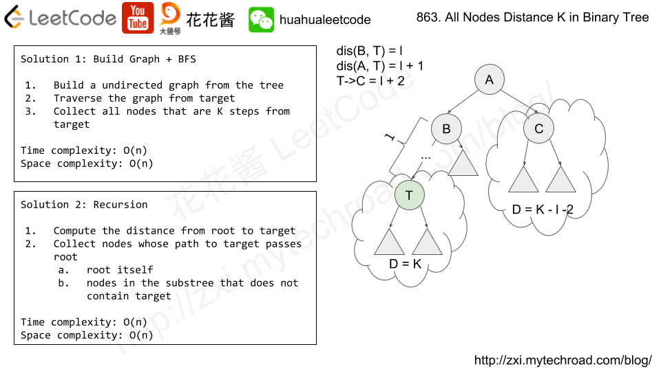

# 863. 二叉树中所有距离为 K 的结点

[链接](https://leetcode-cn.com/problems/all-nodes-distance-k-in-binary-tree/description/)

给定一个二叉树（具有根结点 `root`）， 一个目标结点 `target` ，和一个整数值 `K` 。

返回到目标结点 `target` 距离为 `K` 的所有结点的值的列表。 答案可以以任何顺序返回。

 


**示例 1：**

```
输入：root = [3,5,1,6,2,0,8,null,null,7,4], target = 5, K = 2

输出：[7,4,1]

解释：
所求结点为与目标结点（值为 5）距离为 2 的结点，
值分别为 7，4，以及 1


注意，输入的 "root" 和 "target" 实际上是树上的结点。
上面的输入仅仅是对这些对象进行了序列化描述。
```

**提示：**

1. 给定的树是非空的，且最多有 `K` 个结点。
2. 树上的每个结点都具有唯一的值 `0 <= node.val <= 500` 。
3. 目标结点 `target` 是树上的结点。
4. `0 <= K <= 1000`.

**思路分析**

[参考链接](https://www.youtube.com/watch?v=o1siL8eKCos)



- 1.将树转换成无向图，再BFS
- 2.递归

**我的实现1：无向图+BFS**

```c++
/**
 * Definition for a binary tree node.
 * struct TreeNode {
 *     int val;
 *     TreeNode *left;
 *     TreeNode *right;
 *     TreeNode(int x) : val(x), left(NULL), right(NULL) {}
 * };
 */
class Solution {
public:
    vector<int> distanceK(TreeNode* root, TreeNode* target, int K) {
        vector<int> res;
        if(!root || !target) return res;
        buildGraph(nullptr,root);
        unordered_set<TreeNode*> visited;
        queue<TreeNode*> q;
        q.push(target);
        visited.insert(target);
        int step = 0;
        while(!q.empty() && step<=K)
        {
            int sz = q.size();
            while(sz--)
            {
                TreeNode* cur = q.front();
                q.pop();
                if(step==K) res.push_back(cur->val);
                for(auto c : graph[cur])
                {
                    if(visited.find(c)!=visited.end()) continue;
                    q.push(c);
                    visited.insert(c);
                }
            }
            ++step;
        }
        return res;
    }
private:
    unordered_map<TreeNode*,vector<TreeNode*>> graph;
private:
    void buildGraph(TreeNode* parent, TreeNode* child)
    {
        if(parent)
        {
            graph[parent].push_back(child);
            graph[child].push_back(parent);
        }
        if(child->left) buildGraph(child,child->left);
        if(child->right) buildGraph(child,child->right);
    }
};
```

